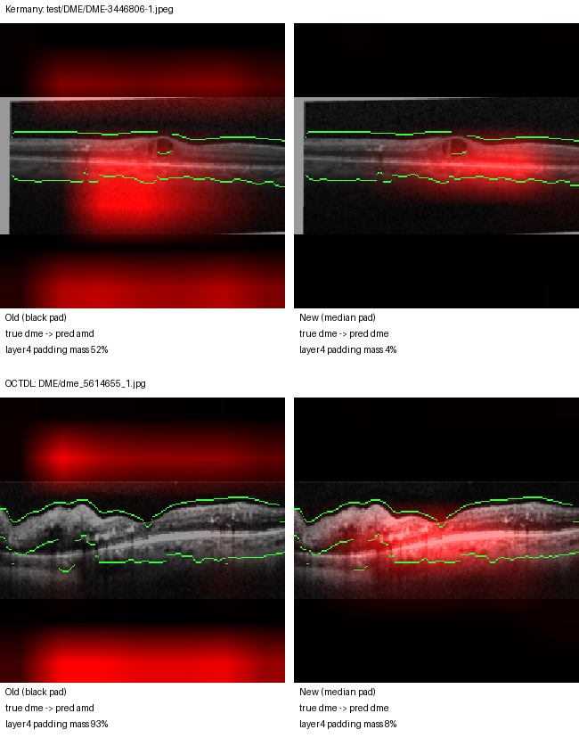

# Median Padding vs. Black Padding: Duke-Baseline Comparison

## Scope and Provenance

[20260927-resnet50-analysis.md](20260927-resnet50-analysis.md) found that the Duke-only ResNet-50
baseline (black letterbox padding) puts 80-95% of its `layer4` Grad-CAM mass on padding or fill when
evaluated on Kermany and OCTDL — well above those sources' own 56-63% canvas share — and recommended
changing how padding is handled, then rechecking with `analyze gradcam`.

This report is that recheck. All five Duke-CV outer folds were retrained at commit `1332242` ("feat:
add median padding option to preprocessing") using `configs/training/resnet50-median-pad.toml`
(`data.padding = "median"`, everything else unchanged from `configs/training/resnet50.toml`), then
evaluated and analyzed the same way as the original baseline:

```bash
uv run oct-classify train baseline --source duke \
    --training-config configs/training/resnet50-median-pad.toml \
    --split-dir artifacts/splits/duke-cv/fold-{1..5} \
    --run-name local-20260927-duke-median-pad-fold{1..5} --device cuda

uv run oct-classify train evaluate --checkpoint <checkpoint> --source duke \
    --split-dir artifacts/splits/duke-cv/fold-{1..5} --device cuda   # own-fold test split
uv run oct-classify train evaluate --checkpoint <checkpoint> --source {kermany,octdl,paima} --device cuda

uv run oct-classify analyze run artifacts/runs/duke/resnet50/local-20260927-duke-median-pad-fold{1..5}
uv run oct-classify analyze campaign --name baseline-duke-median-pad \
    artifacts/runs/duke/resnet50/local-20260927-duke-median-pad-fold{1..5}
uv run oct-classify analyze gradcam artifacts/runs/duke/resnet50/local-20260927-duke-median-pad-fold{1..5}
```

New runs: `artifacts/runs/duke/resnet50/local-20260927-duke-median-pad-fold{1..5}`. New campaign:
`data/analysis/baseline-duke-median-pad/`. The old runs and `data/analysis/baseline-duke/` are
unchanged and used here as the "before" side of every comparison. Nothing else about the model,
data splits, or evaluation procedure differs between the two conditions.

## 1. Classification Metrics

Macro-F1, percent, mean point estimate with 95% cluster-bootstrap interval across the 5 folds. Duke
rows are `pooled` (45 eyes / 3,231 B-scans concatenated across folds); cross-source rows are `shared`
(each of the other sources' fixed test split scored by all 5 checkpoints).

| Set | Old (black pad) | New (median pad) |
|---|---:|---:|
| Duke, eye-level | 95.54 [88.2, 100.0] | 97.78 [92.6, 100.0] |
| Duke, image-level | 93.30 [87.9, 97.6] | 91.26 [85.0, 96.5] |
| Cross-source -> Kermany | 23.41 [21.8, 25.0] | 28.96 [27.3, 30.5] |
| Cross-source -> OCTDL | 30.52 [27.2, 33.2] | 41.74 [35.7, 46.4] |
| Cross-source -> PAIMA | 59.03 [53.9, 64.0] | 65.45 [60.9, 69.4] |

- Duke's own held-out performance is unchanged within the CI overlap in both directions — expected,
  given how few patients back each Duke interval (see the caveat in the prior report and
  `docs/reports/20260927-resnet50-analysis.md` §Key Findings 1). Do not read the small image-level
  dip as a regression.
- Cross-source generalization improved on all three other sources, most clearly for Kermany and
  OCTDL, where the old and new intervals barely overlap. This is a side effect of removing the
  padding shortcut, not a change targeted at cross-source accuracy — the Duke model still was not
  trained on these sources.

## 2. Grad-CAM Padding Shortcut

Mean share of `layer4`/`layer3` Grad-CAM mass for the predicted class, averaged over the 5
checkpoints, error / control. Canvas padding-or-fill share is fixed per source (same preprocessing
geometry in both conditions).

| Evaluated on | Canvas padding share | Old padding mass (err/ctrl) | New padding mass (err/ctrl) | Old outside-retina (err/ctrl) | New outside-retina (err/ctrl) |
|---|---:|---:|---:|---:|---:|
| Duke (own test) | 27% | 1.7 / 22.6 | 0.7 / 21.4 | 57.8 / 62.7 | 47.5 / 59.2 |
| Kermany | 56% | 79.8 / 71.5 | 53.0 / 45.7 | 93.5 / 90.4 | 79.8 / 75.5 |
| OCTDL | 63% | 94.8 / 89.0 | 77.0 / 65.7 | 99.1 / 94.7 | 88.9 / 81.2 |
| PAIMA | 61% | 57.3 / 47.4 | 45.8 / 39.2 | 77.9 / 73.2 | 71.3 / 68.6 |

- **Kermany: shortcut resolved.** Padding mass drops from well above the 56% canvas share to below
  it (53.0/45.7%). The model now spends less than an even-attention share on padding.
- **OCTDL: shortcut reduced by roughly half but not eliminated.** Padding mass falls from 94.8/89.0%
  to 77.0/65.7%, still above the 63% canvas share. Median padding is a partial fix here, not a full
  one — OCTDL's letterbox geometry differs most from Duke's near-square scans, consistent with the
  original report's hypothesis.
- **PAIMA: was never above its canvas share (57.3% vs. 61%); the new padding mass (45.8%) is lower
  still**, so no reclassification, just a smaller margin below threshold.
- **Duke (in-domain) is unchanged**, as expected — the shortcut was never present here (27% canvas
  share, near-zero padding mass in both conditions).
- Randomization-check Spearman medians stayed low (-0.13 to 0.27 across sets in the new runs, same
  range as before), so these CAMs still depend on learned weights rather than image edges.

## 3. Example: Same Image, Both Checkpoints

Two Kermany/OCTDL DME scans that both fold-1 checkpoints evaluated, chosen because the old model
mispredicted them and the new model did not:



In both cases the old (black-pad) model's `layer4` attention sits almost entirely on the letterbox
bars above and below the scan; the retina itself gets little weight and the prediction is wrong. The
new (median-pad) model's attention concentrates on the retina band, and the prediction flips to
correct. These are the two largest per-image padding-mass drops among the checkpoints' shared gallery
images (fold-1 `eval-kermany`/`eval-octdl`), not a cherry-picked average case — see §2 for the
aggregate.

## 4. Leave-One-Source-Out (Fused Training)

The Duke-only result above asks whether median padding removes a shortcut. The LOSO campaign asks
whether it still matters once the model trains on three sources. The campaign
(`scripts/train-loso-local.sh`, run `local-20261001-132356`, `configs/training/resnet50-loso-median-pad.toml`)
was compared with the earlier black-pad campaign (`local-20260918-082742`,
`configs/training/resnet50-loso.toml`). The two configs differ only in `data.padding`. Each held-out
source is scored on its full manifest (`train evaluate --full-source`). Held-out Duke has one model;
the others have 5 checkpoints, one per Duke-CV fold of the training data.

```bash
uv run oct-classify analyze run <run> --sets eval-<source>-loso
uv run oct-classify analyze gradcam <run> --sets eval-<source>-loso --device cuda
```

Both commands ran on every checkpoint of both campaigns.

### 4.1 Classification

Held-out macro-F1, percent, mean ± SD across the 5 checkpoints; the paired difference is new minus old
per fold.

| Held out | Old (black pad) | New (median pad) | Paired Δ per fold | Folds improved |
|---|---:|---:|---|---:|
| Duke (1 model) | 87.4 | 86.7 | -0.7 | n/a |
| Kermany | 74.0 ± 4.0 | 73.2 ± 6.8 | -9.2, -1.7, -2.0, +7.6, +1.3 | 2/5 |
| OCTDL | 90.2 ± 1.7 | 91.9 ± 1.5 | -1.1, +4.2, +2.8, +4.6, -2.0 | 3/5 |
| PAIMA | 86.7 ± 2.0 | 86.2 ± 2.7 | +0.1, -3.2, +1.3, +2.6, -3.5 | 3/5 |

- No source shows a change that is distinguishable from fold-to-fold noise. Kermany's fold SD rose
  from 4.0 to 6.8 and DME recall fell from 67.6% to 65.5%.
- OCTDL moved in the favorable direction (+1.7 mean), driven by DME recall (70.5% to 77.6%) with normal
  and AMD recall unchanged. With 3/5 folds improved, treat it as suggestive only.
- Duke eye-level macro-F1 is identical (93.3). Image-level AUROC fell from 97.2 to 94.7 and normal
  recall from 98.2% to 92.1%, while DME recall rose from 69.8% to 75.4%. This is a single model on a
  6-patient test set.

### 4.2 Grad-CAM Padding Mass

Mean `layer4` Grad-CAM mass for the predicted class, padding mass / outside-retina mass in percent.
This is gallery images only; canvas padding share is the same as in §2.

| Held out | Canvas padding share | Group | Old (black) | New (median) |
|---|---:|---|---:|---:|
| Duke | 27% | control | 1.7 / 44.3 | 3.3 / 47.4 |
| | | error | 5.6 / 49.4 | 8.0 / 50.9 |
| Kermany | 56% | control | 4.0 / 45.6 | 4.0 / 45.7 |
| | | error | 13.3 / 60.7 | 17.3 / 60.2 |
| OCTDL | 63% | control | 12.5 / 42.4 | 14.8 / 45.4 |
| | | error | 16.3 / 48.2 | 21.4 / 52.4 |
| PAIMA | 61% | control | 19.4 / 49.3 | 19.7 / 54.8 |
| | | error | 13.9 / 43.6 | 17.4 / 48.4 |

- Neither condition shows a padding shortcut: padding mass is 2-22% against canvas shares of 27-63%.
  The Duke-only baselines put 80-95% (black pad) and 53-77% (median pad) on padding for Kermany and
  OCTDL.
- Median padding does not lower padding mass further; it is flat or 0-5 points higher, mostly on error
  images. That is within what I would expect from fold and gallery-sampling noise, not an improvement.
- This is consistent with §4.1: with three training sources, the padding shortcut is already gone, so
  there is nothing for median padding to remove.

## 5. Conclusion

Median padding does what [20260927-resnet50-analysis.md](20260927-resnet50-analysis.md) §5 asked of
it: the Duke-only model no longer treats Kermany's padding as a shortcut, treats OCTDL's padding
shortcut about half as strongly, and gains cross-source macro-F1 on all three other sources, at no
measurable cost to in-domain Duke performance. In the LOSO campaign (§4), where the model trains on
three sources, median padding makes no measurable difference to held-out macro-F1 or padding mass, since
the padding shortcut is not present there to begin with. It matters for the single-source Duke baseline,
not for fused training. OCTDL still exceeds its canvas padding share, so it
remains a candidate for the other options in that report (crop to content, or randomize padding
geometry during training) if a full fix is needed there.

## 6. Caveats

- Same caveats as the source report apply: Duke intervals are wide by construction (few patients);
  `layer4` is a coarse 7x7 map upsampled to 224x224, so compare conditions rather than reading
  absolute attention shares; the retina band is a visually-checked heuristic.
- The padding-mass table aggregates gallery images only (up to 24 errors/cell + 24 controls/class per
  run), the same sampling `analyze gradcam` used for the original report — not the full test sets.
- The LOSO comparison (§4) has 5 folds per source that share training data, so the SDs are rough and
  none of the differences would hold up under a formal test. Kermany's wide fold swings match the noisy
  checkpoint-selection metric noted in memory (`fused-cv-unweighted-mean-noise`), and held-out Duke is
  one model scored on 6 patients. Gallery error-image counts differ between campaigns because the
  gallery follows each model's own mistakes.
- Reproduce the figure with `.scratchpad/1332242_median-pad-report/render_comparison.py` (ad hoc,
  not part of the package); it reads each run's `analysis/<set>/gradcam/{cams,masks}.npz` and
  `gradcam.csv`.
